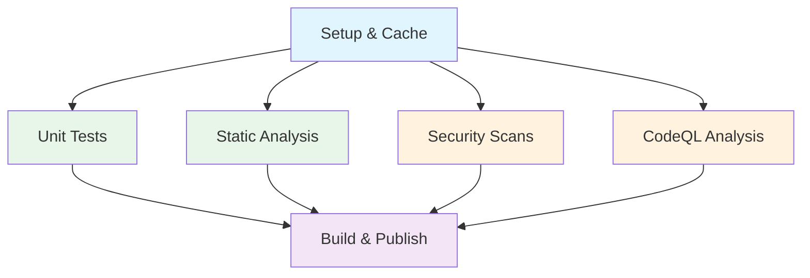

# 🔄 CI/CD and Publishing

This guide covers the automated CI/CD pipeline, versioning strategy, publishing to PowerShell Gallery, and repository maintenance.

## CI/CD Pipeline Overview

The template includes a comprehensive GitHub Actions workflow that automates quality checks, builds, and releases.

### Pipeline Architecture



**Pipeline Stages:**

1. **Setup & Cache** → Prepares environment and caches dependencies
2. **Parallel Quality Gates:**
   - Unit Tests (Pester)
   - Static Analysis (PSScriptAnalyzer)
   - Security Scans (InjectionHunter)
   - CodeQL Analysis
3. **Build & Publish** → Compiles module, generates help, creates releases

### Workflow Jobs

#### 1. Setup and Caching

- Caches PowerShell modules for faster builds
- Sets up PowerShell 7+ environment
- Installs dependencies via PSDepend

#### 2. Unit Tests

- Runs Pester tests with code coverage
- Generates coverage reports (Cobertura format)
- Uploads test results as artifacts
- Fails build if tests don't pass

#### 3. Static Code Analysis

- Runs PSScriptAnalyzer on all source files
- Validates code against best practices
- Checks for style violations
- Generates analysis report

#### 4. Security Scans

**InjectionHunter:**
- Scans for SQL/Command/Script injection vulnerabilities
- Checks for unsafe string concatenation
- Validates input sanitization

**CodeQL:**
- Semantic code analysis
- Detects security vulnerabilities
- Runs weekly scheduled scans
- Language: PowerShell

#### 5. Build and Publish

- Compiles module with ModuleBuilder
- Generates help documentation (MAML + Markdown)
- Creates GitHub Release (if on main branch)
- Publishes to PowerShell Gallery (optional)

### Workflow Triggers

| Trigger             | When              | Quality Gates       | Publish             |
|---------------------|-------------------|---------------------|---------------------|
| **Pull Request**    | PR opened/updated | ✅ All jobs run     | ❌ No               |
| **Push to main**    | PR merged         | ✅ All jobs run     | ⚠️ Prerelease only  |
| **Manual Dispatch** | User triggered    | ✅ All jobs run     | ✅ Optional         |
| **Schedule**        | Weekly (CodeQL)   | 🔒 Security only    | ❌ No               |

### Skipping Workflows

For documentation-only changes, the workflow intelligently skips unnecessary jobs:

```yaml
# CI automatically skips tests for:
- *.md files
- docs/** files
- .github/** workflow files (except changes to ci.yml itself)
```

## Versioning Strategy

### GitVersion Configuration

This template uses **Semantic Versioning (SemVer)** with automated version management:

- **Workflow**: GitHub Flow (main branch + feature branches)
- **Main branch**: Production-ready code, every commit can be released
- **Feature branches**: Development work, PRs required to merge
- **Version source**: Git history and tags

### Version Format

```plaintext
Major.Minor.Patch-PreReleaseLabel

Examples:
- 1.0.0           (Release)
- 1.2.3-alpha.1   (Prerelease)
- 2.0.0-beta.2    (Prerelease)
```

### Controlling Version Bumps

Add semantic versioning keywords to commit messages:

| Keyword | Version Change | Example | Use Case |
|---------|---------------|---------|----------|
| `+semver: breaking` or `+semver: major` | 1.0.0 → 2.0.0 | Breaking API changes |
| `+semver: feature` or `+semver: minor` | 1.0.0 → 1.1.0 | New features (backward compatible) |
| `+semver: fix` or `+semver: patch` | 1.0.0 → 1.0.1 | Bug fixes |
| `+semver: none` or `+semver: skip` | No change | Documentation updates |

### Commit Message Examples

```bash
# Major version bump (breaking changes)
git commit -m "Remove deprecated Get-OldFunction command +semver: major"
git commit -m "Change parameter types to be more specific +semver: breaking"

# Minor version bump (new features)
git commit -m "Add Get-Something function +semver: minor"
git commit -m "Add optional -Force parameter to Get-Data +semver: feature"

# Patch version bump (bug fixes)
git commit -m "Fix parameter validation in Get-Something +semver: patch"
git commit -m "Correct error handling for edge case +semver: fix"

# No version change
git commit -m "Update README examples +semver: none"
git commit -m "Fix typo in comment +semver: skip"
```

### Version Calculation

GitVersion automatically calculates versions based on:

1. **Latest Git tag** - Starting point
2. **Commit history** - Commits since last tag
3. **Branch name** - Determines prerelease labels
4. **Semver keywords** - Explicit version control

Example:

```plaintext
Current tag: v1.2.3

Commits on main:
- "Add feature X +semver: minor"
- "Fix bug Y +semver: patch"

Calculated version: 1.3.0
```

### Build Types

| Build Context | Version Format | Published | Use Case |
|---------------|---------------|-----------|----------|
| **Release** | `1.2.3` | ✅ PowerShell Gallery | Production releases |
| **Prerelease** | `1.2.3-alpha.5` | ⚠️ Optional | Testing releases |
| **Debug** | `1.2.3-PullRequest.123` | ❌ Never | Development/PR builds |

## Publishing to PowerShell Gallery

### Prerequisites

1. **PowerShell Gallery Account**: [Register here](https://www.powershellgallery.com/)
2. **API Key**: Generate in your PSGallery account settings
3. **GitHub Secret**: Store API key as `PSGALLERY_API_KEY` in repository secrets

### Setting Up Publishing

#### 1. Create PowerShell Gallery API Key

1. Log in to [PowerShell Gallery](https://www.powershellgallery.com/)
2. Navigate to **Account Settings** → **API Keys**
3. Click **Create** and set:
   - **Key Name**: GitHub Actions CI/CD
   - **Select Scopes**: Push new packages and package versions
   - **Select Packages**: All packages or specific module name
   - **Expiration**: 1 year (or your preference)

#### 2. Add GitHub Repository Secret

1. Go to your repository on GitHub
2. Navigate to **Settings** → **Secrets and variables** → **Actions**
3. Click **New repository secret**
4. Set:
   - **Name**: `NUGETAPIKEY_PSGALLERY`
   - **Value**: Your PowerShell Gallery API key
5. Click **Add secret**

#### 3. Configure Module Manifest

Ensure your module manifest has proper metadata:

```powershell
# src/YourModuleName.psd1
@{
    ModuleVersion = '0.1.0'  # Auto-updated by GitVersion
    
    Author = 'Your Name'
    CompanyName = 'Your Company'
    Copyright = '(c) 2026 Your Name. All rights reserved.'
    Description = 'Comprehensive description for PowerShell Gallery'
    
    # PowerShell Gallery metadata
    PrivateData = @{
        PSData = @{
            Tags = @('PowerShell', 'Automation', 'Module', 'YourTag')
            LicenseUri = 'https://github.com/YourUsername/YourModule/blob/main/LICENSE'
            ProjectUri = 'https://github.com/YourUsername/YourModule'
            IconUri = 'https://github.com/YourUsername/YourModule/raw/main/icon.png'
            ReleaseNotes = 'See CHANGELOG.md or GitHub Releases'
        }
    }
}
```

### Publishing Workflows

#### Automatic Publishing (Recommended)

**On Main Branch:**

Every merge to `main` creates a prerelease version:

```bash
# 1. Merge PR to main
# 2. CI automatically builds and creates GitHub Release
# 3. Prerelease published to PowerShell Gallery (if configured)
```

#### Manual Publishing

**Via GitHub Actions Workflow Dispatch:**

1. Navigate to **Actions** → **CI** workflow
2. Click **Run workflow**
3. Configure:
   - `version-tag`: Optional version tag (e.g., `v1.2.3`)
   - `publish`: ✅ Check to publish to PowerShell Gallery
4. Click **Run workflow**

**Via Command Line:**

```powershell
# Build and publish from local machine
Invoke-Build -ReleaseType Release -NugetApiKey 'YOUR-API-KEY'

# Or publish existing build
Publish-Module -Path ./build/out/YourModuleName -NuGetApiKey 'YOUR-API-KEY'
```

### Publishing Best Practices

✅ **Do:**

- Test thoroughly before publishing to PowerShell Gallery
- Use prerelease versions for beta testing
- Include comprehensive release notes
- Tag releases with meaningful descriptions
- Maintain a CHANGELOG.md
- Verify module metadata is accurate

❌ **Don't:**

- Publish untested code
- Skip version numbers (maintain semver)
- Publish modules with hardcoded credentials
- Forget to update documentation

### Version Publishing Strategy

```plaintext
Development Flow:

feature/new-feature (PR)
    ↓ Tests, Analysis, Security Scans
    ↓ All checks pass
    ↓
main (Merge)
    ↓ Automatic build
    ↓ Version: 1.2.3-alpha.1
    ↓ GitHub Release created
    ↓ Optional: Prerelease to PSGallery
    ↓
Manual Workflow Dispatch
    ↓ User triggers with "publish" flag
    ↓ Version: 1.2.3
    ↓ GitHub Release updated
    ↓ Published to PowerShell Gallery
```

## GitHub Releases

### Automatic Release Creation

The CI workflow automatically creates GitHub Releases:

**On main branch:**
- Creates release with version tag
- Generates release notes from merged PRs
- Attaches module package as artifact
- Marks as prerelease

**Components:**

```plaintext
Release v1.2.3
├── Release Notes (auto-generated from PRs)
├── Assets:
│   ├── YourModuleName-1.2.3.zip
│   └── Source code (auto-attached by GitHub)
└── Metadata:
    ├── Tag: v1.2.3
    ├── Commit: abc123
    └── Prerelease: true/false
```

### Release Notes

Release notes are automatically generated from:

- **PR titles**: Main content
- **PR descriptions**: Additional details
- **Labels**: Categorization (bug, feature, breaking)

**Example Release Notes:**

```markdown
## What's Changed

### 🚀 Features
- Add Get-Something function by @username in #123
- Support pipeline input for Get-Data by @username in #124

### 🐛 Bug Fixes
- Fix parameter validation in Get-Something by @username in #125

### 📖 Documentation
- Update README examples by @username in #126

**Full Changelog**: https://github.com/.../compare/v1.2.0...v1.2.3
```

## Repository Maintenance

### Automated Cleanup Workflows

The template includes automated maintenance to keep your repository clean:

#### Artifact Cleanup

Automatically removes old build artifacts:

- **Schedule**: Daily at midnight (UTC)
- **Retention**: 2 days (configurable)
- **Targets**: Test results, coverage reports, build outputs

#### Workflow Run Cleanup

Removes old workflow runs to manage storage:

- **Schedule**: Daily at midnight (UTC)
- **Retention**: Keeps recent 2 runs per workflow (configurable)
- **Policy**: Configurable by workflow status (success, failure, cancelled)

### Manual Maintenance

#### Trigger Cleanup Manually

1. Navigate to **Actions** → **Cleanup** workflow
2. Click **Run workflow**
3. Configure retention period
4. Click **Run workflow**

#### Adjust Cleanup Settings

Edit `.github/workflows/cleanup.yml`:

```yaml
# Adjust retention periods
env:
  ARTIFACT_RETENTION_DAYS: 7     # Keep artifacts for 7 days
  MIN_RUNS_TO_KEEP: 5            # Keep at least 5 runs per workflow
```

### Storage Management

**Monitor storage usage:**

1. Go to **Settings** → **Actions** → **Runners**
2. View storage usage
3. Adjust retention policies if needed

**Typical storage usage:**

```plaintext
Per Build:
- Artifacts: ~10-50 MB
- Workflow logs: ~5-10 MB

Monthly (with defaults):
- ~500 MB - 1 GB
```

## Troubleshooting CI/CD

### Build Failures

**Problem**: Tests fail in CI but pass locally

```powershell
# Solution: Check for environment differences
# - Module versions (check requirements.psd1)
# - PowerShell version (CI uses 7.x)
# - Environment variables
# - File paths (use platform-agnostic paths)
```

**Problem**: PSScriptAnalyzer failures

```powershell
# Solution: Run locally with same settings
Invoke-ScriptAnalyzer -Path ./src -Recurse `
    -Settings ./tests/PSScriptAnalyzer/PSScriptAnalyzerSettings.psd1
```

### Publishing Failures

**Problem**: Publishing fails with authentication error

```yaml
# Solution: Verify GitHub secret
# 1. Check NUGETAPIKEY_PSGALLERY exists
# 2. Verify API key hasn't expired
# 3. Regenerate key if needed
```

**Problem**: Version already exists on PowerShell Gallery

```powershell
# Solution: Version conflict
# - You cannot republish the same version
# - Bump version with proper semver keyword
# - Or use prerelease version: 1.2.3-alpha.1
```

### Version Issues

**Problem**: Version not incrementing

```bash
# Solution: Check commit message includes semver keyword
git commit -m "Your message +semver: minor"

# Verify GitVersion configuration
cat GitVersion.yml
```

**Problem**: Wrong version calculated

```bash
# Solution: Check git tags and history
git tag -l
git log --oneline --graph

# Manually tag if needed
git tag v1.0.0
git push origin v1.0.0
```

### GitHub Actions Issues

**Problem**: Workflow not triggering

```yaml
# Solution: Check workflow triggers in .github/workflows/ci.yml
# Ensure your branch/PR matches trigger conditions
```

**Problem**: Workflow steps failing

```yaml
# Solution: Check workflow logs
# 1. Go to Actions tab
# 2. Select failed workflow run
# 3. Expand failed step
# 4. Review error messages
```

## CI/CD Best Practices

### Commit Practices

✅ **Do:**

- Include semver keywords in commit messages
- Write descriptive commit messages
- Keep commits focused and atomic
- Reference issues in commit messages (#123)

❌ **Don't:**

- Commit without running tests locally
- Mix multiple changes in one commit
- Forget semver keywords (results in no version bump)

### Pull Request Practices

✅ **Do:**

- Wait for all CI checks to pass before merging
- Review CI test results and coverage reports
- Update documentation if API changes
- Request reviews from team members

❌ **Don't:**

- Merge failing PRs ("I'll fix it later")
- Skip CI checks with admin override
- Ignore PSScriptAnalyzer warnings

### Release Practices

✅ **Do:**

- Use prereleases for testing
- Test prereleases before promoting to release
- Maintain semantic versioning discipline
- Document breaking changes in release notes

❌ **Don't:**

- Skip versions (e.g., 1.0.0 → 1.0.2)
- Make breaking changes in patch versions
- Publish untested code to PowerShell Gallery

## Advanced Configuration

### Customizing CI Workflow

Edit `.github/workflows/ci.yml`:

```yaml
# Change test coverage threshold
- name: Run Tests
  run: |
    Invoke-Build Invoke-UnitTests
  env:
    COVERAGE_THRESHOLD: 80  # Change to your requirement

# Add custom quality gates
- name: Custom Check
  run: |
    # Your custom validation
```

### Custom GitVersion Configuration

Edit `GitVersion.yml`:

```yaml
# Change version increment behavior
mode: ContinuousDelivery
increment: Inherit

# Customize branch configuration
branches:
  main:
    tag: ''
    increment: Patch
```

## Resources

- 📖 [GitHub Actions Documentation](https://docs.github.com/actions)
- 📖 [GitVersion Documentation](https://gitversion.net/)
- 📖 [PowerShell Gallery Publishing](https://docs.microsoft.com/powershell/gallery/how-to/publishing-packages/publishing-a-package)
- 📖 [Semantic Versioning](https://semver.org/)
- 📖 [GitHub Flow](https://guides.github.com/introduction/flow/)

---

**Automate everything! Ship with confidence! 🚀**
